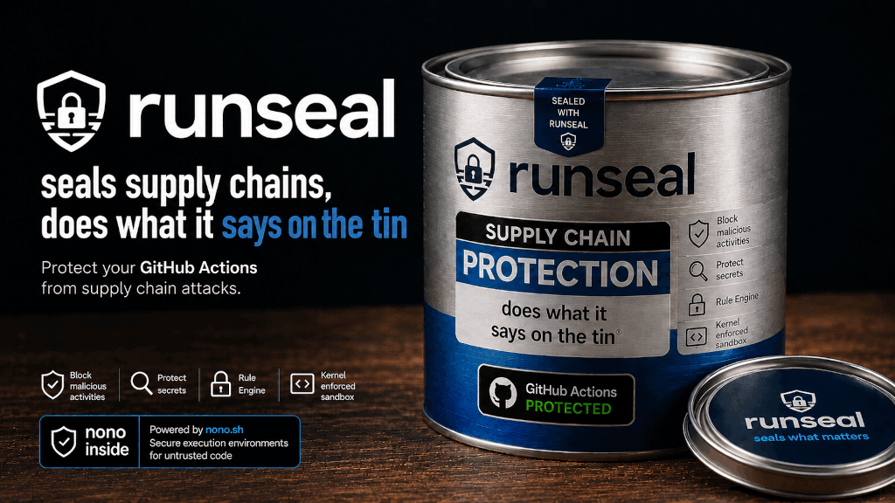

<div align="center">
<h1>runseal</h1>


<p>
  From the creator of
  <a href="https://sigstore.dev"><strong>Sigstore</strong></a>
  <br/>
  <sub>The standard for secure software attestation, used by PyPI, npm, brew, and Maven Central</sub>
</p>
  <a href="https://discord.gg/pPcjYzGvbS">
    
  </a>
   <a href="https://alwaysfurther.ai/careers">
      
  </a>
</p>
</div>
Runseal provides a sandboxed environment for CI steps that need secrets, network access, or filesystem access.

By using [nono's](https://github.com/always-further/nono) strong kernel enforced sandboxing, runseal can protect secrets, files and network access from untrusted code, while still allowing necessary operations through a flexible policy system.

## What Runseal Does

- Replace raw secrets within a workflow with phantom credentials that are useless if leaked
- Protects sensitive files and secrets from exfiltration by untrusted code in CI
- L7 network filtering to lock down network access by HTTP method and path
- Uses `nono` TLS interception so HTTPS requests can be filtered by method/path
- Blocks network by default unless policy explicitly allows a host or credential route
- Restricts filesystem reads and writes to declared paths
- Cryptographic audit captured outside of the sandbox for all network requests, credential injections, and filesystem access

## Quick Start

```yaml
name: Publish

on:
  workflow_dispatch:

jobs:
  publish:
    runs-on: ubuntu-latest
    steps:
      - uses: actions/checkout@v4

      - uses: always-further/runseal@v1
        with:
          run: npm publish
          policy: |
            fs:
              read: ["."]
              write: []
            network:
              default: blocked
            credentials:
              NPM_TOKEN:
                host: registry.npmjs.org
                inject:
                  mode: header
                endpoints:
                  - method: PUT
                    path: "/**"
        env:
          NPM_TOKEN: ${{ secrets.NPM_TOKEN }}
```

In this example, `npm publish` can read the repository, cannot write to paths
not listed in `fs.write`, cannot use general network access, and can only use
`NPM_TOKEN` through the Runseal/nono proxy for allowed HTTPS requests to
`registry.npmjs.org`.

## Policy Format

Runseal policy is YAML passed through the `policy` input.

```yaml
fs:
  read:
    - "."
    - "$HOME/.cache/my-tool"
  write:
    - "./dist"

network:
  default: blocked
  allow:
    - api.github.com

credentials:
  DEPLOY_TOKEN:
    host: api.example.com
    inject:
      mode: header
    endpoints:
      - method: POST
        path: "/v1/deployments"
      - method: GET
        path: "/v1/deployments/*"
```

### Filesystem Access

`fs.read` lists paths the command can read. `fs.write` lists paths the command
can write.

Keep these narrow. For example, a deploy step often only needs to read `./dist`
and a config file, and may not need write access at all.

```yaml
fs:
  read: ["./dist", "./fly.toml"]
  write: []
```

### Network Access

Runseal expects `network.default: blocked`.

Add `network.allow` only for unauthenticated hosts the command must reach. Hosts
used by credentials are added to the generated `nono` profile automatically.

```yaml
network:
  default: blocked
  allow:
    - api.github.com
```

### Credential Injection

Each key under `credentials` is the name of an environment variable containing a
GitHub secret. Runseal reads the value, masks it in logs, writes it to a private
file, removes it from the child environment, and configures `nono` to inject it
through the local proxy.

```yaml
credentials:
  FLY_API_TOKEN:
    host: api.machines.dev
    inject:
      mode: header
    endpoints:
      - method: POST
        path: "/v1/apps/*/machines"
```

The sandboxed command receives a phantom credential for SDK compatibility. The
real secret remains outside the sandbox and is only inserted by the proxy when
the host and endpoint policy match.

### HTTPS Endpoint Filtering

`endpoints` restricts credential use by HTTP method and path. When any endpoint
rules are present for a credential, matching is allow-list based.

```yaml
endpoints:
  - method: POST
    path: "/v1/apps/*/releases"
  - method: GET
    path: "/v1/apps/*/status"
```

Runseal relies on `nono` TLS interception for this. The `nono` proxy creates an
ephemeral trust bundle and injects standard CA environment variables into the
sandboxed process, so common HTTPS clients can connect through the proxy while
still allowing L7 policy enforcement.

## Common Recipes

### Run Tests With No Network

```yaml
- uses: always-further/runseal@v1
  with:
    run: npm test
    policy: |
      fs:
        read: [".", "./node_modules"]
        write: ["./coverage"]
      network:
        default: blocked
```

### Build With Package Registry Access

```yaml
- uses: always-further/runseal@v1
  with:
    run: npm ci
    policy: |
      fs:
        read: ["."]
        write: ["./node_modules"]
      network:
        default: blocked
        allow:
          - registry.npmjs.org
```

### Deploy With A Sealed Token

```yaml
- uses: always-further/runseal@v1
  with:
    run: ./scripts/deploy.sh
    policy: |
      fs:
        read: ["./dist", "./deploy.yaml"]
        write: []
      network:
        default: blocked
      credentials:
        DEPLOY_TOKEN:
          host: deploy.example.com
          inject:
            mode: header
          endpoints:
            - method: POST
              path: "/v1/releases"
            - method: GET
              path: "/v1/releases/*"
  env:
    DEPLOY_TOKEN: ${{ secrets.DEPLOY_TOKEN }}
```

## Inputs

| Input | Required | Default | Description |
| --- | --- | --- | --- |
| `run` | Yes | none | Command to execute inside the sandbox. |
| `policy` | No | empty | Runseal policy YAML. Prefer this for new workflows. |
| `fs-read` | No | empty | Legacy comma-separated read paths when `policy` is not set. |
| `fs-write` | No | empty | Legacy comma-separated write paths when `policy` is not set. |
| `network` | No | `blocked` | Legacy network policy: `blocked` or comma-separated domains. |
| `credentials` | No | empty | Legacy credential mappings: `SECRET_NAME:host:inject_mode`. |
| `endpoint-rules` | No | empty | Legacy endpoint rules: `SECRET_NAME:METHOD:path_glob`. |
| `runseal-version` | No | `latest` | Runseal release version to install. Accepts `v0.1.0` or `0.1.0`. |
| `nono-version` | No | `latest` | nono release version to install. Accepts `v0.1.0` or `0.1.0`. |
| `verify-attestations` | No | `true` | Verify GitHub artifact attestations for downloaded release assets. |

## Legacy Input Example

Structured policy is recommended, but simple workflows can use the legacy inputs:

```yaml
- uses: always-further/runseal@v1
  with:
    run: ./scripts/deploy.sh
    fs-read: "./dist, ./deploy.yaml"
    fs-write: ""
    network: blocked
    credentials: |
      DEPLOY_TOKEN:deploy.example.com:header
    endpoint-rules: |
      DEPLOY_TOKEN:POST:/v1/releases
  env:
    DEPLOY_TOKEN: ${{ secrets.DEPLOY_TOKEN }}
```

## Supply Chain Verification

The installer verifies release downloads in two layers:

- SHA-256 checksum from the release `SHA256SUMS` file
- GitHub artifact attestation proving the asset was built by the expected
  repository and tag, for both `always-further/runseal` and `always-further/nono`

Attestation verification uses `gh attestation verify` and is enabled by default.
Set `verify-attestations: false` only for local testing or emergency fallback.

## Requirements

- Linux x86_64 GitHub-hosted runner
- `gh` CLI available on the runner for attestation verification
- Published release assets for both Runseal and `nono`

Release assets are expected to use this naming scheme:

- `runseal-v<version>-x86_64-unknown-linux-gnu.tar.gz`
- `nono-v<version>-x86_64-unknown-linux-gnu.tar.gz`
- `SHA256SUMS`

## Development

```bash
cargo fmt
cargo test
```
